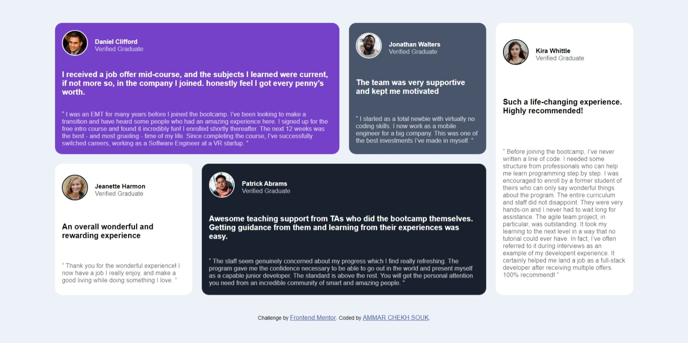

# Frontend Mentor - Testimonials grid section solution

This is a solution to the [Testimonials grid section challenge on Frontend Mentor](https://www.frontendmentor.io/challenges/testimonials-grid-section-Nnw6J7Un7). Frontend Mentor challenges help you improve your coding skills by building realistic projects. 

## Table of contents

- [Overview](#overview)
  - [The challenge](#the-challenge)
  - [Screenshot](#screenshot)
  - [Links](#links)
- [My process](#my-process)
  - [Built with](#built-with)
- [Author](#author)

## Overview

### The challenge

Users should be able to:

- View the optimal layout for the site depending on their device's screen size

### Screenshot

### Links

- Solution URL: [Add solution URL here](https://github.com/AmmarChS/gride)
- Live Site URL: [Add live site URL here](https://ammarchs.github.io/gride/)

## My process

### Built with

- html
- css
- Flexbox
- CSS Grid

## Author

- Website - [AMMAR CHEKH SOUK](https://ammarchs.github.io/CV/)
- Frontend Mentor - [@AmmarChS](https://www.frontendmentor.io/profile/AmmarChS)

